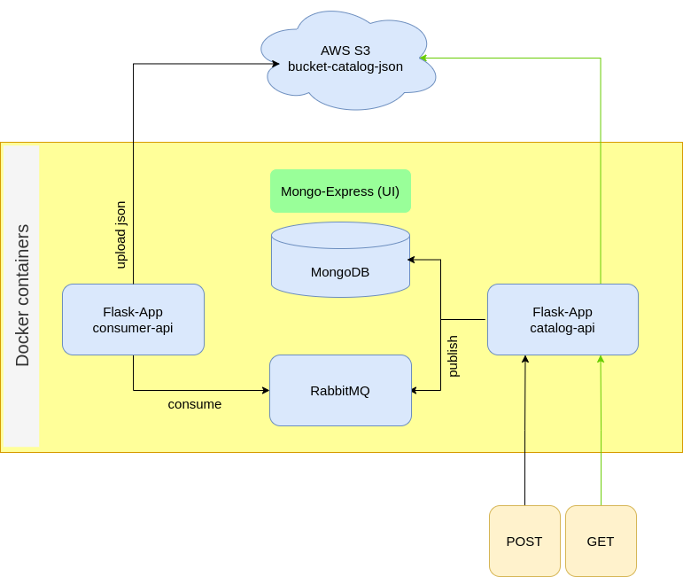

# catalog_app
# To run correctly follow the steps:
- add AWS/S3 credentials
- RUN:
  - docker compose up -d
- On RabbitMQ UI (http://localhost:15672/) create the queue, exchange and bind them
- On Mongo Express UI (http://localhost:8081/) create the database and collections
- RUN again the container for "app-consumer" (now the rabbitMQ error should disappear)
- Now you can access the main application (http://localhost:5000) to CRUD registers on MongoDB

This project was inspired by: https://github.com/githubanotaai/new-test-backend-nodejs 
